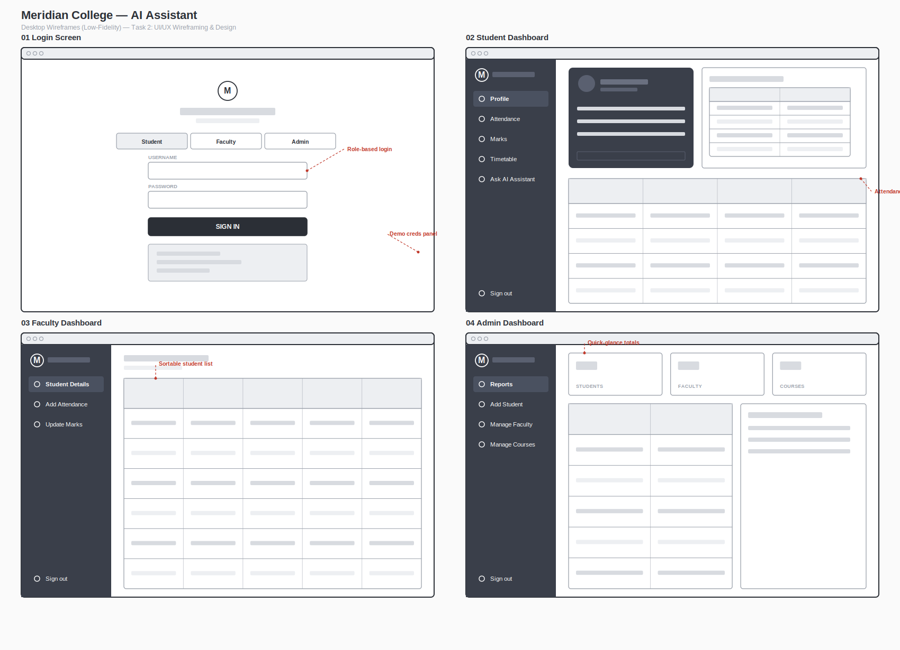
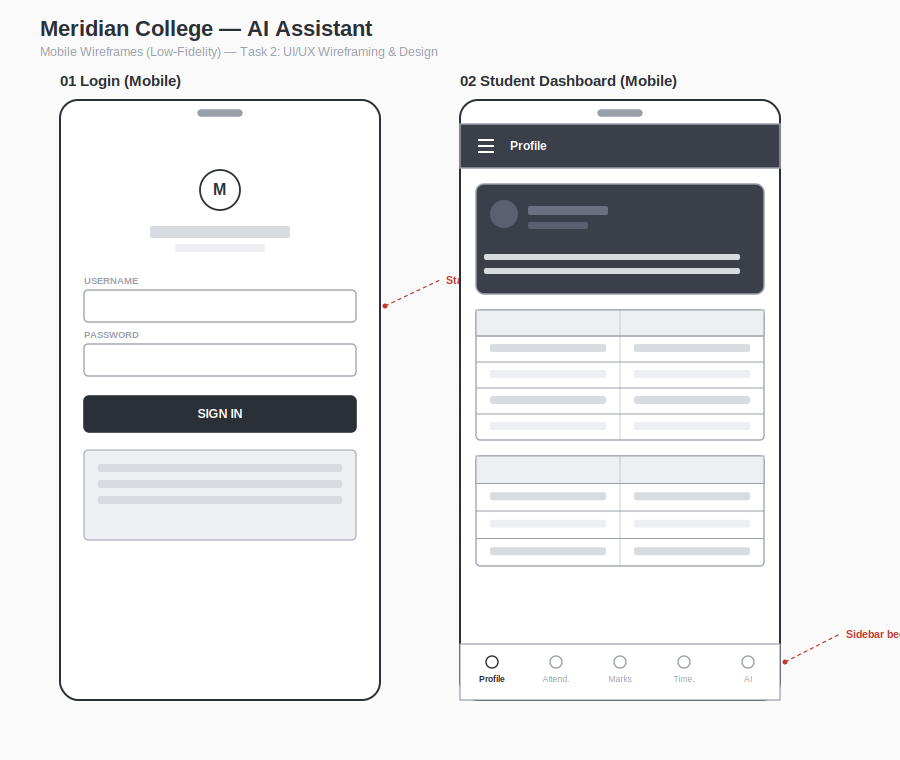

# Meridian College — Backend API

Express + MongoDB (Mongoose) + JWT backend covering Internship Tasks 4, 5, and 6:

- **Task 4 — Backend Development & API Setup:** Node.js + Express, RESTful routes (GET/POST/PUT/DELETE).
- **Task 5 — Database Design & Integration:** MongoDB with Mongoose models/collections for Users, Students, Faculty, and Courses.
- **Task 6 — Authentication & Authorization:** Password hashing (bcrypt) + JWT-based login, with role-based route protection for student / faculty / admin.

## 1. Setup

```bash
npm install
cp .env.example .env
# then edit .env with your own MONGO_URI, JWT_SECRET, and ANTHROPIC_API_KEY
```

You need a MongoDB instance — either install MongoDB locally, or create a free cluster at MongoDB Atlas and paste its connection string into `MONGO_URI`.
## UI/UX Wireframes (Task 2)

Low-fidelity wireframes for desktop and mobile, created before development began:




## 2. Seed demo data

```bash
npm run seed
```

This wipes the database and creates one course (`CSEAIML`) plus several demo accounts per role:

| Role    | Username        | Password    | Notes |
|---------|-----------------|--------------|-------|
| Admin   | admin           | admin123     | |
| Admin   | admin2          | admin123     | |
| Faculty | f101            | faculty123   | Dr. Ananya Rao — Python |
| Faculty | f102            | faculty123   | Mr. Karthik Iyer — Java |
| Faculty | f103            | faculty123   | Dr. Sneha Kulkarni — Machine Learning |
| Faculty | f104            | faculty123   | Mr. Arjun Mehta — Data Structures |
| Student | s101            | student123   | Rahul Sharma |
| Student | s102            | student123   | Priya Singh |
| Student | s103            | student123   | Aditya Verma (low attendance — good for testing the "at risk" report) |
| Student | s104            | student123   | Sneha Patel |

## 3. Run the server

```bash
npm run dev      # with nodemon, auto-restarts on changes
# or
npm start
```

The API runs on `http://localhost:5000` by default.

## 4. Authentication flow

1. `POST /api/auth/login` with `{ "username": "...", "password": "..." }` returns a JWT.
2. Send that token on every subsequent request as a header: `Authorization: Bearer <token>`.
3. The token encodes the user's role, so each route group only accepts the right role (enforced server-side, not just hidden in the frontend).

Example login with curl:

```bash
curl -X POST http://localhost:5000/api/auth/login \
  -H "Content-Type: application/json" \
  -d '{"username":"s2301","password":"student123"}'
```

Example authenticated request:

```bash
curl http://localhost:5000/api/student/attendance \
  -H "Authorization: Bearer <paste token here>"
```

## 5. API reference

### Auth
- `POST /api/auth/login` — `{ username, password }` → `{ token, user }`

### Student (role: student)
- `GET /api/student/profile`
- `GET /api/student/attendance`
- `GET /api/student/marks`
- `GET /api/student/timetable`
- `POST /api/student/ask-ai` — `{ question }` → calls the Claude API server-side using the student's own attendance/marks/timetable as context

### Faculty (role: faculty)
- `GET /api/faculty/students` — students in the faculty member's course
- `POST /api/faculty/attendance` — `{ studentId, status: "present" | "absent" }`
- `PUT /api/faculty/marks` — `{ studentId, score }`

### Admin (role: admin)
- `POST /api/admin/students` — `{ name, username, password, studentId, courseCode, year }`
- `POST /api/admin/faculty` — `{ name, username, password, facultyId, subject, courseCode }`
- `GET /api/admin/faculty` — list all faculty with their current subject and course
- `PUT /api/admin/faculty/:id` — `{ subject, courseCode? }` — change a faculty member's subject (and optionally their course)
- `POST /api/admin/courses` — `{ code, name, subjects: [String] }`
- `GET /api/admin/courses`
- `DELETE /api/admin/courses/:id`
- `GET /api/admin/reports` — totals, averages, and at-risk students (attendance below 75%)

## 6. Project structure

```
ai-college-backend/
  server.js              # app entry point
  config/db.js           # Mongoose connection
  models/                # User, Student, Faculty, Course schemas
  middleware/auth.js      # verifyToken + authorize() role guard
  controllers/            # business logic per module
  routes/                 # Express routers per module
  utils/seed.js           # demo data seeder
  .env.example
```

## 7. Connecting this to the frontend

In the frontend, store the JWT (e.g. in memory or a cookie — avoid localStorage for anything sensitive) after login, then call these endpoints with `fetch()` or `Axios`, attaching the `Authorization: Bearer <token>` header on every request, instead of using the in-browser storage used by the earlier prototype.
